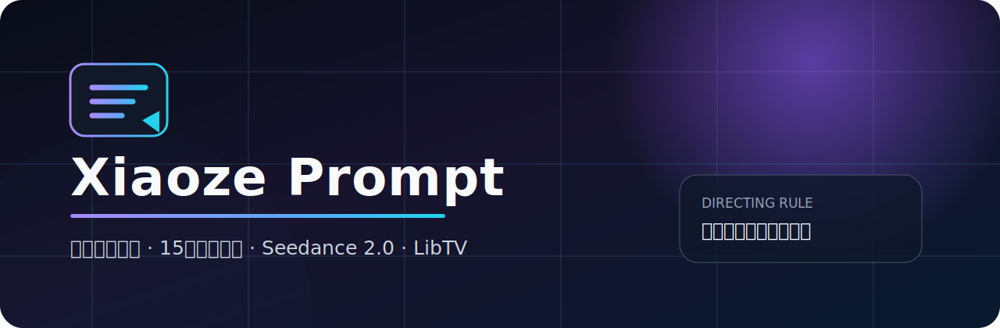
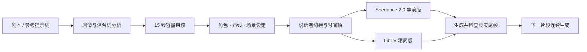

<div align="center">
  
</div>

<div align="center">
  <p><strong>把中文剧本变成可直接执行的真人短剧分镜与 Seedance 2.0 提示词</strong></p>
  <p>
    
    
    
    
    
  </p>
</div>

## 它解决什么问题

普通 AI 提示词经常只会堆叠“电影感、氛围感、缓慢推进”，却没有回答真正影响成片的问题：台词能否在 15 秒内说完、什么时候切镜、谁产生口型、听者何时反应、下一段如何承接。

`xiaoze-prompt` 将剧本先做容量与导演分析，再输出适合真人短剧制作的执行方案：

- 单次生成最长 15 秒，逐句测算对白、停顿、动作和反应时间
- 说话者变化前明确切镜，标注准确的硬切时间点
- 锁定角色、声线、服装、道具、轴线、视线和灯光连续性
- 同时输出 Seedance 2.0 导演版与 LibTV 精简执行版
- 用户提供的 AI 提示词只作参考，允许优化，但逐项说明改了什么
- 内心旁白保持人物闭嘴，可跨证物、环境和对手反应镜头
- 长剧情按已接受成片的真实尾帧继续，不拿计划状态冒充连续性

## 调用

```text
/xiaoze-prompt
```

也可以显式调用：

```text
$xiaoze-prompt
```

然后直接粘贴剧本、分镜草稿或其他 AI 生成的参考提示词。

## 工作流



## 输出示例

输入：

> 皇帝低声问：“你房间的玄冥毒镖和女子衣料，从何而来？”太子随后替九皇子说话，实际逼他交代昨夜去向。

输出不会只写“大全景缓慢前推”，而会先建立剪辑结构：

| 镜头 | 本地时间 | 画面 | 对白与口型 | 转场 |
|---|---:|---|---|---|
| 01 | 0–1.2s | 偏殿低机位大全景，建立三人位置和证物 | 无人说话 | — |
| 02 | 1.2–6.8s | 皇帝 50mm 中近景，极轻微推进 | 只有皇帝产生口型 | 1.2s 硬切 |
| 03 | 6.8–8.0s | 九皇子 85mm 反应近景 | 嘴唇闭合 | 6.8s 硬切 |

下一名角色开口时，会先切到该角色，不让镜头对着主角却出现别人的口型。

## 默认交付内容

1. 时长容量结论与拆分方案
2. 剧情、冲突、潜台词和情绪推进
3. 角色卡、固定声线与表演状态
4. 场景、道具、服装、轴线和连续性设定
5. 每个片段的首帧状态、尾帧状态与叙事任务
6. 精确到秒的分镜、景别、机位、焦段、运镜与硬切点
7. Seedance 2.0 完整导演版提示词
8. LibTV 精简提示词与节点命名
9. 原方案与修改后方案的逐项对照

## 安装

将仓库克隆到 Codex Skills 目录：

```powershell
git clone https://github.com/zhaojinze86-code/xiaoze-prompt.git "$HOME/.codex/skills/xiaoze-prompt"
```

重新打开 Codex 任务或重启应用，让技能列表刷新。

## 项目结构

```text
xiaoze-prompt/
├── SKILL.md                       # 核心工作流与触发规则
├── agents/openai.yaml             # Codex 调用界面配置
├── references/
│   ├── output-template.md         # 标准交付结构
│   └── production-rules.md        # 时长、剪辑与连续性规则
└── assets/xiaoze-prompt-banner.svg
```

## 设计原则

> 镜头不是装饰。谁说话就切给谁，谁承受就切给谁反应；每一次运镜、停顿和微表情都必须服务剧情。

